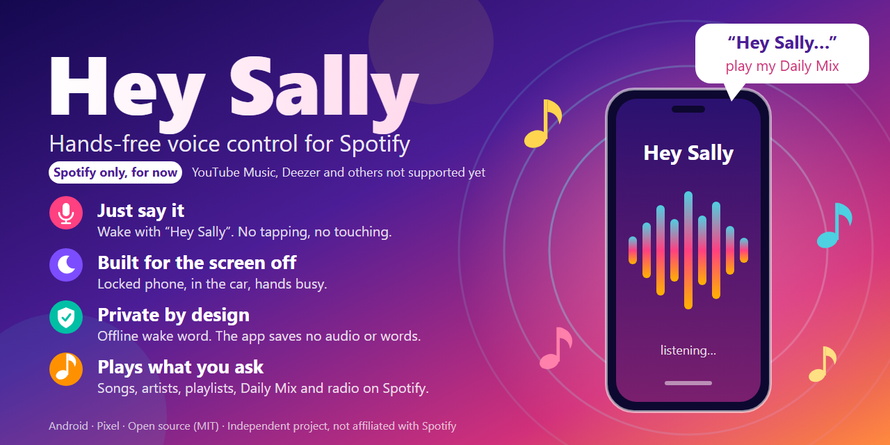

# Spotify Wake Probe

An experimental Android voice assistant for controlling the installed Spotify app with **Hey Sally**. This is an independent project, not an official Spotify product.

Wake recognition runs locally with Vosk. After the ready beep, Android's configured speech recognizer captures one command. Spotify App Remote controls playback, and Spotify Web API resolves named music and saved playlists.

For complete installation steps, all command forms, bug reports, pull requests and the APK release checklist, read [TESTING_AND_DISTRIBUTION.md](TESTING_AND_DISTRIBUTION.md).

## What it is for

- **Spotify only, for now.** Hey Sally controls the Spotify app. It does not control YouTube Music, Deezer, Apple Music or any other player, and has no search or playlist support for them. See the [roadmap](#roadmap-toward-an-assistant-replacement).
- **An Android phone connected over Bluetooth.** The intended setup is an Android phone paired to a car stereo, headset or Bluetooth speaker. You pair the phone with the car in Android as usual; the app has no pairing or Bluetooth logic of its own and does not start when a Bluetooth device connects. It listens with the phone's own microphone, so keep the phone in the cabin. Music and spoken replies play through the phone's normal media output, which is the Bluetooth device while it is connected. The app does not set up a car or headset microphone. Short tests with a Pixel 8 Pro have passed over Bluetooth in a car and with Bluetooth-connected devices at home. Other cars, speakers and headsets, and the ready beep on each route, are not validated.
- **Hands-free, including a locked phone.** Say the wake phrase, wait for the beep, then speak one command. See [what cannot be replicated](#what-cannot-be-replicated-and-why) for the limits.

## Download the test APK

[Download Hey Sally 0.2.1-alpha.1 for ARM64 Android](https://github.com/Fudnut/hey-sally-pixel-phone-assistant-replacement/releases/download/v0.2.1-alpha.1/Hey-Sally-0.2.1-alpha.1-arm64.apk). Read [INSTALL.md](INSTALL.md) for phone installation, your own Spotify Developer setup, commands and bug reports. This is an experimental prerelease for Android 14+, not a Play Store release. No compilation is needed; Spotify registration/authorization is still required.

The public APK has a separate signing identity from private trial/self-built APKs; do not uninstall an existing trial to resolve a signature conflict without saving its diagnostics and choosing a migration. See [RELEASE_SIGNING.md](RELEASE_SIGNING.md).

## Status and requirements

- Prototype tested on a Pixel 8 Pro running Android 17. Other phones and long-term reliability are not established.
- Android 14 or later; ARM64 device. The current build targets API 37.
- Spotify installed and authorized, a Spotify Developer application of your own, and appropriate account access. Premium is required for the development application's owner under current Spotify rules.
- This replaces the phone's default digital assistant while selected. It requires microphone and notification permissions and displays Android's microphone indicator.
- Set up and test while stationary. False wakes, missed commands and background/audio-route interactions remain possible.

## Build from source

Requirements: PowerShell, Git, an Android SDK containing API 37 and its required build tools, and a JDK compatible with Gradle 9.3.1 (JDK 17 or newer supported by that Gradle version).

```powershell
# Run in the repository root. Both downloads verify pinned SHA-256 values.
./fetch-spotify-sdk.ps1
./fetch-model.ps1

# Set this to your own Android SDK installation.
$env:ANDROID_HOME = 'C:\path\to\Android\Sdk'
./gradlew.bat :app:assembleDebug
./tests/check-playlists.ps1
```

Gradle uses your machine's standard debug signing key. No personal signing key or Spotify Client ID is included. The APK is created at `app/build/outputs/apk/debug/app-debug.apk`. On other platforms, use `./gradlew` and PowerShell (`pwsh`) for the download scripts.

Install the debug APK using Android's normal developer tools. A build signed with a different key cannot update an existing installation of the same package. Do not uninstall an existing trial merely to test this copy: uninstalling loses its settings and private history. The public prerelease uses a dedicated release certificate; local debug builds remain separate.

## Configure Spotify and Android

1. Register your own application in the [Spotify Developer Dashboard](https://developer.spotify.com/dashboard). Configure redirect URI `http://127.0.0.1:8765/callback`.
2. If Android package/signature fields are offered, use `com.steve.spotifywakeprobe` and the SHA-1 fingerprint from **your** build (`./gradlew.bat :app:signingReport`). The package is retained for compatibility; the repository contains no personal registration values.
3. Enter your Developer Client ID in the app and tap **Save Client ID**. A Client ID is public configuration; never put a Client Secret in the Android app.
4. Use **Authorize Spotify playback** and **Authorize named music and private playlists** while unlocked. The latter uses PKCE and requests private-playlist access.
5. Grant microphone and notification permissions. Choose **Spotify Wake Probe** under Android Settings → Apps → Default apps → Digital assistant app. The app can open Default apps settings for you.
6. Say **Hey Sally**, wait for the ready beep, then speak a command. Use a fresh wake phrase for each command. After reboot, unlock once so the offline model is accessible.

A public repository does not remove Spotify's API access restrictions. Development-mode apps require allowed users and have limited capacity; check the current [quota-mode documentation](https://developer.spotify.com/documentation/web-api/concepts/quota-modes). Others should configure their own Developer application rather than expect access through a shared personal registration.

## Commands

The downloadable GitHub APK is still alpha.1. The main branch prepares alpha.2: expanded control phrasing, numeric songs outside playlist browsing, spoken ordinary failures and additional wake diagnostics apply to that next build.

| Say after the beep | Behavior |
| --- | --- |
| Open Spotify | Open the Spotify app |
| Pause / Stop / Resume | Control current playback; Stop pauses |
| Next song / Previous song | Change track |
| Play song Stand by Me | Search for a song |
| Play artist The Beatles | Search for an artist |
| Play playlist followed by its name | Match a saved playlist |
| List my playlists | Read five playlist names with numbers |
| More playlists | Read the next page |
| Play two / Play number two | Select a number already read aloud while playlist browsing is active |
| Play Liked Songs | Play the collection if Spotify exposes it |
| Play DJ | Play Spotify DJ if available to your account |
| Play Daily Mix two / Play Made For You 02 | Request Daily Mix 2; supported numbers are 1–6 |
| Play radio followed by an artist | Match a recommended or saved Radio playlist |
| Play Local Files | Use a native collection if exposed, otherwise a saved playlist named Local Files |

Controls accept filler words such as `please`, `the` and `music`: for example, `pause the music`, `skip this song` and `play the next song`. Named song, artist and playlist requests retain their titles.

Playlist numbering expires three minutes after the last successful readout. `play number two` always means playlist selection and asks for a fresh list when none is active. Outside an active browse, bare `play one` or `play 1` searches for a numeric song title; use `play song one` to request it while browsing. A request such as `play number of the beast` or `play number 9 dream` searches the full title; `number` selects a playlist only when the whole remainder is a number. Names are matched within a bounded lookup, so not every available Spotify collection is guaranteed to be found.

Radio cannot generate any artist's station on demand. If a station is absent from recommendations, open the artist in Spotify, choose **Go to Radio**, and save the station before retrying the voice command. The save-and-retry workflow has passed a device test.

Made For You means Daily Mix 1–6 here. Native Local Files was not exposed on the tested device; local tracks in a normal playlist still need to be playable in Spotify on that phone. Availability of DJ and personalized collections depends on Spotify and the account.

## Speech and audio

The command-language selector supports US, Australian, UK and New Zealand English, or the phone's English locale. It does not automatically detect an accent. The offline wake/fallback model remains US English. Replies use Android's default text-to-speech voice and media audio volume/output. Car-speaker routing has passed a short test; device-specific behavior remains possible.

Wake capture requests Android's privacy-sensitive microphone mode to reduce interference from other background recorders. This can prevent background song identification or other recording features while listening. Stop the listener when another recording app needs the microphone. Call/camera/recorder coexistence is not fully validated.

## Privacy and diagnostic history

- The wake recognizer processes microphone audio locally. App-owned code does not save audio recordings or command transcripts.
- After waking, command audio may be processed online by the configured Android speech service, such as Google Speech Services. Provider behavior is outside this app's control.
- Named music queries and Spotify authorization requests go to Spotify. No Gemini integration or project-operated backend is used.
- OAuth tokens are stored encrypted using Android Keystore. Android backup and device transfer are disabled for app data.
- Up to 1,024 diagnostic events remain in app-private storage. They contain timestamps, command categories, counts and outcomes, not playlist names, Spotify URIs or recognized words. Routine non-matching wake results are counted in five-minute summaries, which may be delayed by Android sleep; a partial summary is saved when the service stops. These counts may reveal nearby speech/noise activity. Accepted wakes, debounce rejections, timing and lock/screen states still reveal usage patterns.
- **Copy diagnostic history** puts that history on the clipboard for voluntary sharing. Review it before posting publicly. **Start fresh diagnostic trial** clears the previous timeline; copy it first if needed. Clearing app storage or uninstalling deletes it.

## Roadmap: toward an Assistant replacement

Hey Sally began as a hands-free Spotify controller. The longer-term aim is a small, reliable, rule-based replacement for the parts of Google Assistant that people use most, working from a locked phone and over a car's Bluetooth connection. **Nothing below is built, scheduled or promised.** Each item needs its own permissions, privacy notes and device testing, and the order is not final.

Candidates, roughly in the order being considered:

1. **Alarms and timers**: set, stop and snooze, using Android's public alarm and timer intents.
2. **Calls and texts by contact name**: needs contacts, phone and possibly SMS permissions.
3. **Quick controls**: torch, volume, media keys for other players, do-not-disturb.
4. **Navigation hand-off**: "navigate home" through the Maps intent.
5. **Calendar**: what is on today, add an event.
6. **Other music apps**: basic play, pause and next through Android media controls. Search and playlists would need each service's own API and terms.

The wake detector is meant to stay swappable, so a system hotword interface could replace the CPU-based one if Android ever offers it to third-party apps. No cloud AI model, paid API or Gemini integration is configured or authorised, so open-ended questions and conversation are not on this list.

## What cannot be replicated, and why

Google Assistant runs as a system component with access that ordinary apps do not get. Hey Sally is a normal app selected as the digital assistant, so it can only use public Android interfaces. This list reflects Android and Google documentation as understood on 10 October 2026. Some entries have not been re-tested on a device, so treat them as guidance and open an issue if something is wrong.

| What Assistant does | Why Hey Sally cannot |
| --- | --- |
| Listens with the screen off at very low battery cost | Android's low-power hotword path needs a privileged permission held by system apps. Hey Sally listens continuously on the phone's processor from a foreground service, which costs more battery and shows a permanent microphone indicator. |
| Recognises who is speaking (Voice Match) and gives personal results | Tied to a Google account and Google's models. Hey Sally responds to anyone who says the phrase, including on a locked phone. |
| Acts inside other apps ("message Sam on WhatsApp") | Android's structured app-integration permission goes only to system apps. The alternative, an accessibility service, is restricted for sideloaded apps and sensitive under Google's policies. Not planned. |
| Reads Gmail, Photos, Drive and other Google account data | Needs Google's OAuth app verification and, for public apps, a security assessment. Not planned. |
| Call Screen, Hold for Me, Direct My Call | Pixel and Google phone features that need call audio, which Android does not give ordinary apps. |
| Voice in Android Auto or a car's own assistant button | Closed platform; no route for third-party assistants is known. Hey Sally uses the phone's microphone, not the car's. |
| Runs Assistant Routines and Google Home devices | Other apps cannot start or edit Routines. Smart-home control through Google's Home APIs with user consent is possible in principle but not planned. |
| Switches Wi-Fi, Bluetooth or airplane mode directly | Android removed direct toggles for ordinary apps; an app can only open the settings screen. Torch, volume and, with a user grant, do-not-disturb are possible. |
| Answers open-ended questions and holds a conversation | Needs a large model, either a paid cloud service or a heavy on-device one. Neither is integrated. |
| Proactive suggestions | Not built and not planned. |

**Regulation.** In July 2026 the European Commission adopted a decision under the Digital Markets Act requiring Google to open several Android features to rival AI assistants in the EU, including always-on hotword detection and system integration. Deadlines run from 2027 to 2028, some features depend on a Google certification scheme, and no commitment to apply any of it outside the EU has been found. This project does not depend on it.

**Installing outside Google Play.** Google is introducing developer verification for apps on certified Android devices, enforced from 30 September 2026 in Brazil, Indonesia, Singapore and Thailand and worldwide during 2027. Unregistered apps can still be installed through an advanced flow, and the ADB workflow is unchanged, but installing a public APK may become harder.

## Limitations and verification

Short device checks have demonstrated locked-screen wake, basic controls, named music, playlist readout/numbered selection, several special collections and cable-free operation. They do not establish a success rate, battery-life figure, all-day reliability or support across Android devices. Playback callbacks alone do not prove audible output.

The focused Java checks cover command parsing, regional settings, playlist paging/expiry and destination matching. They do not simulate Android audio focus, microphone priority, Spotify availability or actual car-speaker output.

## Licence

Original project code is licensed under [MIT](LICENSE). Third-party components retain their own terms; see [THIRD_PARTY_NOTICES.md](THIRD_PARTY_NOTICES.md). Downloaded SDK/model files, credentials, diagnostic exports and debug APKs are excluded from Git.
